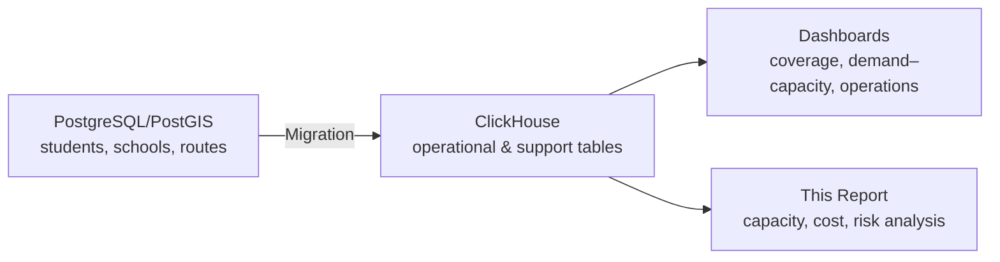
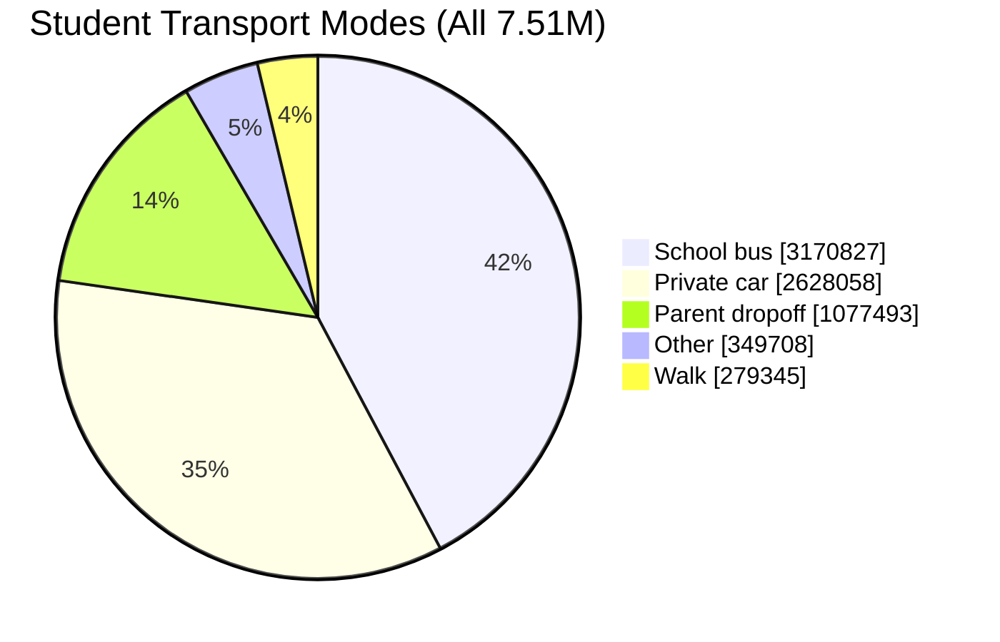
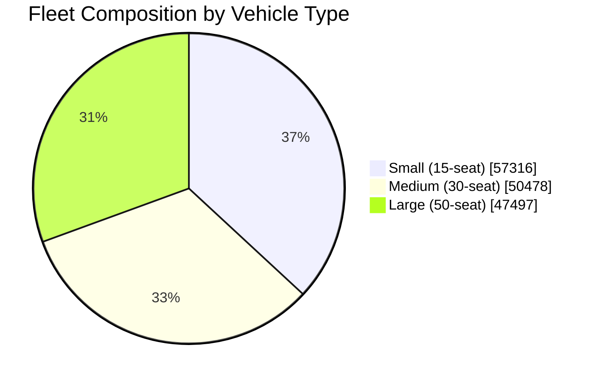
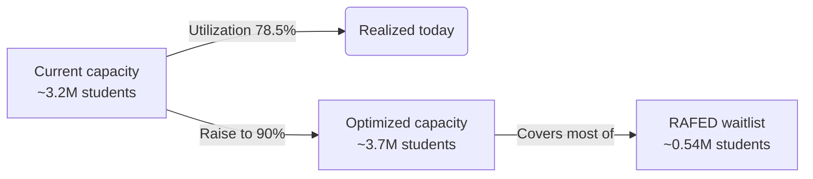
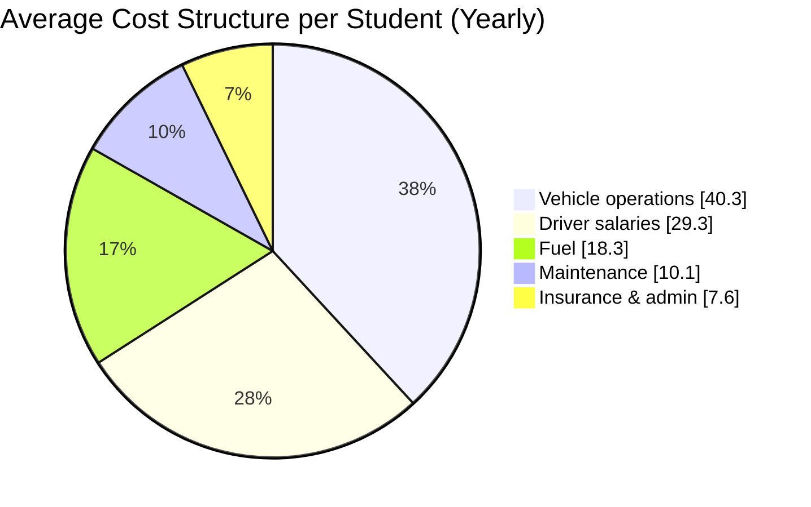
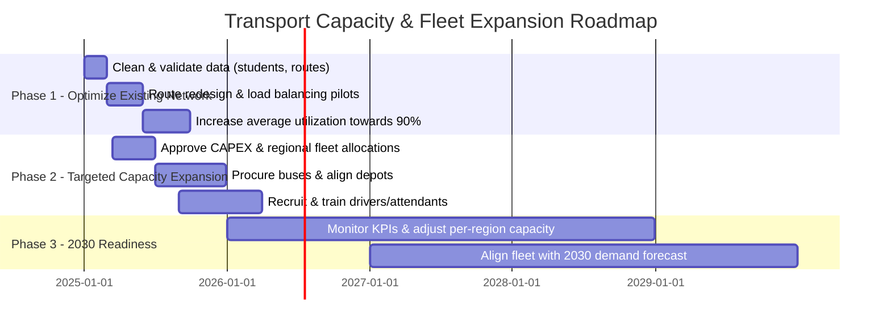

# Student Transport Capacity & Expansion Report (ClickHouse-backed)

**Core Question:**  
How many students can we transfer as a transportation company, using the current RAFED network and fleet, what are the main challenges and risks, and what capacity, cost, and fleet will be required going forward?

**Data Year:** Academic Year **1446 (2024–2025)** for RAFED performance, with a national synthetic micro-simulation of **7.5M** students.

---

## 1. Executive Summary – Answer in Numbers

From the integrated ClickHouse datasets:

- **Total students in model:** **7,505,431**
- **Bus-eligible students (distance-based model, `bus_elig = 1`):**  
  **5,628,918** (≈ **75%** of all students).
- **Students currently using school buses (all systems):**  
  **3,170,827** (**42.25%** of all students).
- **Among bus-eligible students:**
  - On school buses: **2,458,966** (**43.68%** of eligible).
  - Eligible but *not* using bus: **3,169,952** (**56.3%** of eligible).
- **Official RAFED performance (AY 1446 / 2024–2025):**
  - Beneficiaries (served by RAFED): **3,268,936**
  - Waiting list: **537,203**
  - Total eligible within RAFED program: **3,649,991**
  - **RAFED coverage:** **89.56%** of official eligible students.

**Fleet & capacity today:**

- **Fleet size:** **155,291** buses  
  - 57,316 small (≈15 seats)  
  - 50,478 medium (≈30 seats)  
  - 47,497 large (≈50 seats)
- **Total nominal seats:** **4,748,930** (≈30.6 seats per bus).
- **Route-level utilization:**
  - Routes per day: **297,584**
  - Daily boardings: **7,076,974**  
  - Daily route seats: **9,018,395**
  - **Average load factor:** **78.47%** (median **84%**, p90 **100%**).

**How many students can we transport?**

- **Today (realized):**
  - ≈ **3.17 million** students use school buses daily (any provider, based on `trans_mode = 'school_bus'`).
  - Officially within RAFED, **3.27 million** beneficiaries out of **3.65 million** eligible.
- **With operational optimization only (no new buses):**
  - If we raise route utilization from **78.5% → 90%**, we unlock:
    - ≈ **1,039,582** extra seats per day on existing routes.
    - ≈ **466,000** additional *distinct* students (given ≈2.23 boardings per bus user per day).
  - This is **almost enough** to cover the current **RAFED waitlist of 537k** students, assuming geographic alignment and scheduling feasibility.
- **Medium term (to 2030):**
  - Transport-eligible students are forecast to grow from **4.23M (2024)** → **4.93M (2030)** (**+0.7M**, ≈**+17%**).
  - Even after fully optimizing existing routes, **additional fleet and/or trips** will be required to sustain high coverage (>90%) against this growth.

**High-level conclusion:**  
- **Short-term:** With **no new buses**, but better routing and load balancing, the current fleet can plausibly increase effective reach from ≈**3.2M** to ≈**3.7M** students and **substantially clear the current waitlist**.  
- **Medium-term:** To serve future demand (≈**4.9M** eligible by 2030) at similar or higher service levels, **fleet and/or trip capacity must grow by roughly 30–50%**, alongside stronger operations and governance.

---

## 2. Data Sources & ClickHouse Views

**Core fact tables (ClickHouse):**

- `students` – synthetic student population with coordinates and attributes.
- `vw_student_transport_mode` – derived transport mode, eligibility (`bus_elig`), and willingness (`bus_will`).
- `school_buses` – fleet inventory (bus ID, type, capacity, assigned school, route links).
- `school_routes` – detailed route-level boardings, capacity, utilization, distance, and duration.
- `unassigned_students` – students not mapped to any bus route.
- `vw_special_needs_students` – subset of students with special education needs.

**Support / strategic tables:**

- `support_data_report2_rafed_performance_beneficiaries_waiting_list` – official RAFED coverage, waitlist, and eligibility by region.
- `support_data_report3_student_growth_forecast_to_2030` – total and transport-eligible forecast to 2030.
- `support_data_report10_cost_per_student_structure` – base cost per student and cost structure by region.

**Conceptual data flow:**



---

## 3. Demand Profile: Who Needs Transport?

### 3.1 Total Population & Eligibility

From `vw_student_transport_mode`:

- **Total students in model:** **7,505,431**
- **Bus-eligible students (`bus_elig = 1`):** **5,628,918**  
  - ≈ **75%** of all students.

**Mode split:**



- School bus: **3,170,827** (**42.25%**)
- Private car: **2,628,058** (**35.02%**)
- Parent dropoff: **1,077,493** (**14.36%**)
- Walk: **279,345** (**3.72%**)
- Other: **349,708** (**4.66%**)

### 3.2 RAFED Program Coverage

From `support_data_report2_rafed_performance_beneficiaries_waiting_list` (AY 1446 / 2024–2025):

- **Eligible within RAFED:** **3,649,991**
- **RAFED beneficiaries:** **3,268,936**
- **RAFED waiting list:** **537,203**
- **Coverage:** **89.56%** of program-eligible students.

This shows that **within the official program scope**, coverage is already high but **over half a million eligible students** remain unserved.

### 3.3 Special-Needs Students

From `vw_special_needs_students`:

- Special-needs students overall: **374,986** (**≈5%** of all students).
- Bus-eligible special-needs: **281,005** (**≈5%** of bus-eligible).

These students typically require:

- Lower vehicle occupancy,
- Additional time for boarding/alighting,
- Adapted vehicles or equipment.

They therefore **consume capacity faster** than general-education students and need explicit planning.

---

## 4. Fleet & Operational Capacity

### 4.1 Fleet Composition (School Buses)

From `school_buses`:

- **Total buses:** **155,291**
  - **Small (~15 seats):** 57,316
  - **Medium (~30 seats):** 50,478
  - **Large (~50 seats):** 47,497
- **Total nominal seats:** **4,748,930**
- **Average seats per bus:** ≈ **30.6**



### 4.2 Route Utilization

From `school_routes`:

- **Routes per day:** **297,584**
- **Total route seats per day:** **9,018,395**
- **Total boardings per day:** **7,076,974**
- **Average load factor:** **78.47%**
- **Utilization distribution:**  
  - 10th percentile: **33.33%**  
  - Median (50th): **84%**  
  - 90th percentile: **100%**

Interpretation:

- A **significant tail of underutilized routes** exists (<50% load).
- Another tail of **overcrowded routes** runs close to or at 100% capacity.

### 4.3 Extracting “How Many Can We Transport?”

We can translate route capacity and current boardings into **distinct students**:

- Distinct students on school buses (all modes): **3,170,827**
- Boardings per bus user:

  \[
  \text{Boardings per bus student} \approx \frac{7{,}076{,}974}{3{,}170{,}827} \approx 2.23
  \]

This aligns with **two daily trips per student (AM + PM)**, plus some additional multi-trip cases.

**Today, using the existing network, we are transporting on the order of 3.2 million distinct students per day by bus.**

---

## 5. Optimization Scenario – Extra Capacity Without New Buses

Using `school_routes`:

- Total route seats: **9,018,395**
- Current boardings: **7,076,974**
- Current average load factor: **78.47%**

If we increase the **average load factor to 90%** (through better routing, consolidation, and time-window adjustments):

- Seats at 90%: `0.9 × 9,018,395 ≈ 8,116,556`
- Extra seats vs today:  
  `8,116,556 – 7,076,974 ≈ 1,039,582`

Translating extra seats into distinct students:

\[
\text{Extra students} \approx \frac{1{,}039{,}582}{2.23} \approx 466{,}000
\]

**Implication:**

- With **no fleet growth**, pushing utilization from **78.5% → 90%** can likely add capacity for roughly **460–470 thousand additional students**.
- This **almost matches** the current **RAFED waitlist of 537k**, meaning that:
  - **Operational optimization plus minor targeted capacity additions** could, in principle, **clear most of the waitlist.**



---

## 6. Medium- to Long-Term Demand & Required Capacity

From `support_data_report3_student_growth_forecast_to_2030`:

- **Transport-eligible students forecast:**

| Year | Eligible for Transport |
|------|------------------------|
| 2024 | 4,225,000             |
| 2025 | 4,313,725             |
| 2026 | 4,412,944             |
| 2027 | 4,523,281             |
| 2028 | 4,645,436             |
| 2029 | 4,780,199             |
| 2030 | 4,928,455             |

Key points:

- Growth from **4.23M → 4.93M** (≈ **+700k**, or **+17%**) in eligible students.
- Even if the **current 155k-bus fleet is optimized**, **additional seats, trips, or buses** will be necessary to:
  - Maintain coverage near **90–95%**, and
  - Absorb regional shocks (new schools, new housing, demographic shifts).

```mermaid
graph TD
  Y2024[2024: 4.23M eligible] --> Y2027[2027: 4.52M eligible]
  Y2027 --> Y2030[2030: 4.93M eligible]

  classDef future fill=#E0F7FA,stroke=#00796B,stroke-width=1px;
  class Y2030 future;
```

---

## 7. Cost Structure & Financial Implications

From `support_data_report10_cost_per_student_structure`:

- **Average base cost per student:**  
  ≈ **4,182 SAR per student per year** (national average over regions).
- Average cost structure:
  - **Vehicle operations:** **40.3%**
  - **Driver salaries:** **29.3%**
  - **Fuel:** **18.3%**
  - **Maintenance:** **10.1%**
  - **Insurance & admin:** **7.6%**



**Observations:**

- **~70%** of cost is labor + vehicle operations; **fuel alone ≈18%**.
- Every **1 SAR** increase in fuel cost per “fuel unit” will materially increase per-student cost; so **fuel efficiency and route shortening** directly impact affordability.
- Increasing utilization (78.5% → 90%) **reduces cost per student** without increasing the base cost significantly.

---

## 8. Key Challenges & Risks

### 8.1 Operational Challenges

- **Uneven utilization:**
  - Some routes are **below 40%** load (inefficient).
  - Others run **at or near 100%**, creating overcrowding and reliability issues.
- **Geographic misalignment:**
  - Idle seats may be available in regions far from high-demand hotspots.
- **Travel-time constraints:**
  - Long routes in peri-urban and rural areas risk exceeding acceptable ride time (e.g., >60 minutes).

### 8.2 Strategic & Financial Risks

- **Budget stress:** Expanding capacity to meet 2030 demand without optimization will require **significant OPEX and CAPEX**.
- **Over-investment risk:** If growth or willingness to use buses is over-estimated, we could end up with **underutilized assets**.
- **Dependence on fuel prices:** A high fuel cost share (≈18%) exposes the model to global energy volatility.

### 8.3 Human Resources Risks

- **Driver and attendant recruitment & retention**, especially in remote regions.
- **Training and compliance** (safety, student handling, special-needs protocols).
- Potential for **service disruptions** due to HR shortages.

### 8.4 Equity & Special-Needs Risks

- ~**5%** of students have special needs; **281k** of them are bus-eligible.
- These students consume more capacity per route and **cannot simply be “filled in”** on tightly packed buses.
- Risk of **under-serving high-need groups** if planning is based only on averages.

---

## 9. Requirements for Safe & Scalable Expansion

### 9.1 Fleet & Capacity Requirements

- To cover the **current waitlist (~0.54M)**:
  - Prioritize **operational optimization first**, then add **targeted buses** in regions where:
    - Route-level utilization is already high (>90%), and
    - Unmet demand is geographically proximate.
- To reach **2030 demand (~4.93M eligible)**:
  - Plan for **30–50% more effective capacity** (combination of:
    - Additional trips from existing fleet,
    - New buses,
    - Mixed fleet strategy: more medium / small buses in low-density areas).

### 9.2 Technology & Analytics

- Maintain and expand the ClickHouse-based analytics:
  - **Real-time or daily-refresh** views of `vw_student_transport_mode`, `school_routes`, `unassigned_students`, and RAFED KPIs.
  - **Gap analysis dashboards** (demand vs capacity, hotspot maps).
- Introduce or mature:
  - **Route optimization engine** (time windows, load balancing, deadhead reduction).
  - **Simulation tools** for “what-if” scenarios (new schools, new housing areas).

### 9.3 Governance & Policy

- Clear, published **eligibility rules** and prioritization (distance, income, special needs).
- **KPIs and SLAs**:
  - Coverage %, waitlist size,
  - On-time performance,
  - Average ride time,
  - Safety incidents.
- Decision framework for:
  - **Where to expand fleet** vs **where to rationalize routes**,
  - **Trade-offs** between coverage, ride time, and cost.

---

## 10. Roadmap (Illustrative)



---

## 11. Management Recommendations

1. **Recognize that today’s network already transports ≈3.2M students**, with official RAFED coverage at **89.6%** for its eligible base.
2. **Launch a focused optimization program**:
   - Objective: **raise average route utilization from ~78.5% to near 90%**,  
     unlocking capacity for ≈**460k** additional students.
   - This is the fastest, lowest-cost way to **attack the 537k waitlist**.
3. **Plan for controlled capacity expansion** to meet 2030 forecasts:
   - Treat **additional fleet and trips as a second step**, after optimization.
   - Aim for **30–50% more effective capacity** over a 5–6 year horizon.
4. **Protect and prioritize special-needs and high-vulnerability groups**:
   - Dedicated routes, adapted vehicles, explicit KPIs.
5. **Institutionalize data-driven governance**:
   - Embed ClickHouse dashboards into **monthly and quarterly reviews**.
   - Use the views and metrics from this report as **standard management KPIs**.

---
