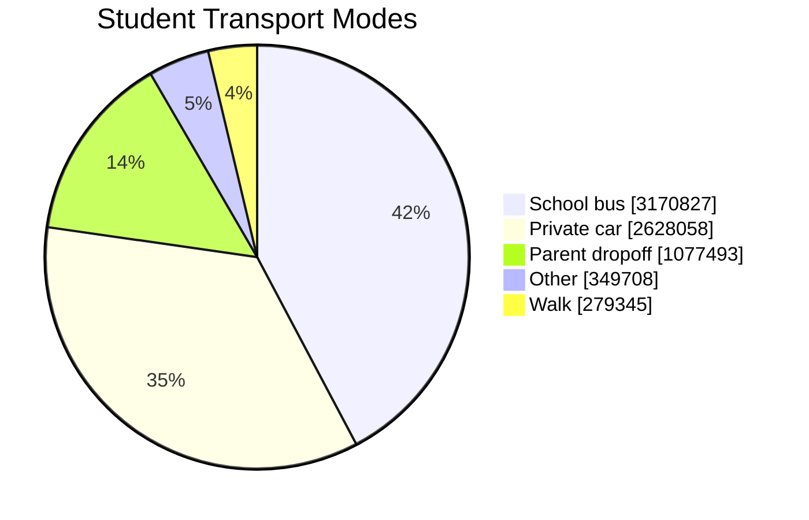
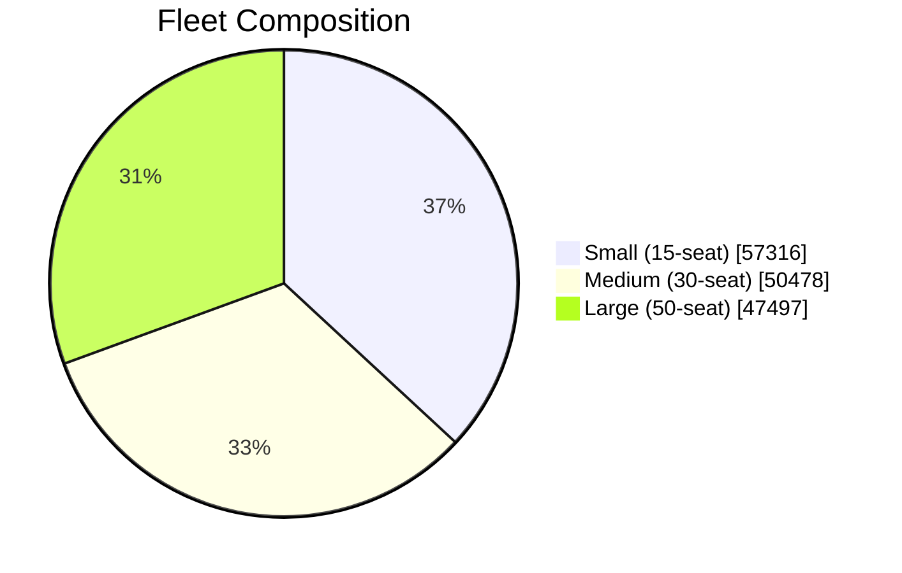
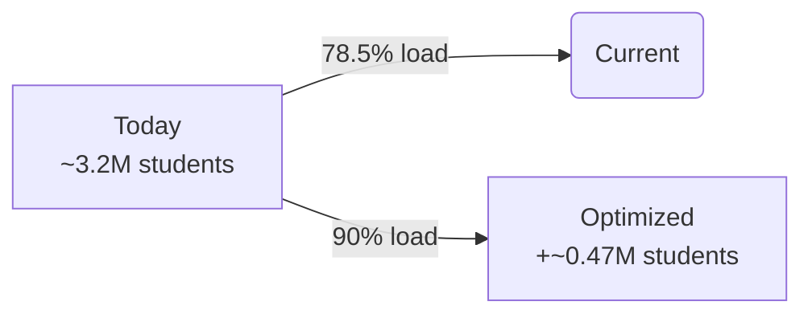
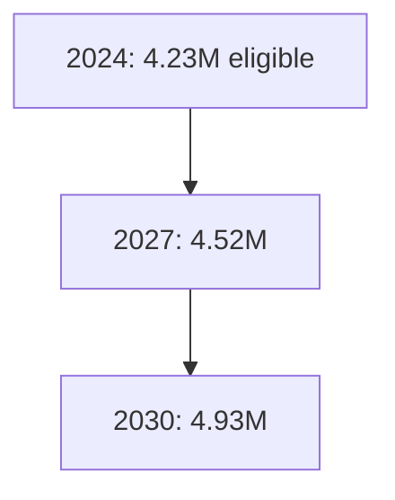
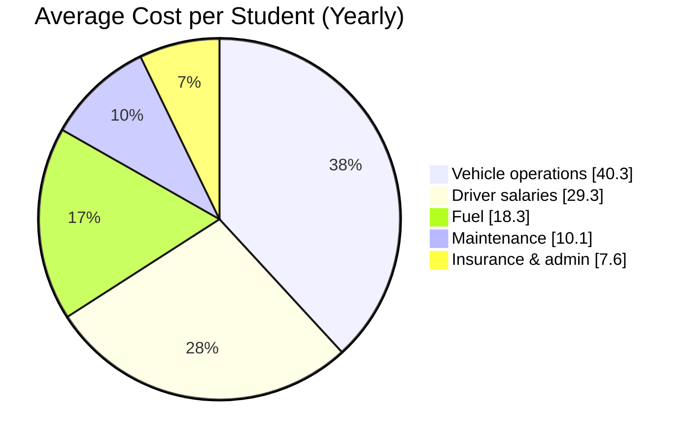
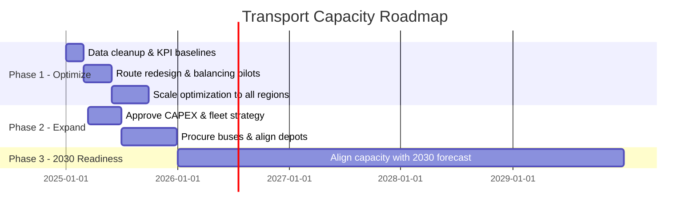

# Slides – Student Transport Capacity, Risks & Future Demand (ClickHouse-backed)

> Use `---` as slide separators in your presentation tool.

---

## Slide 1 – Title

**School Transport Capacity & Expansion**  
How Many Students Can We Transport – Today and by 2030?  

Academic Year: **1446 (2024–2025)**  
Data source: **ClickHouse analytics + RAFED support tables**

---

## Slide 2 – Key Management Question

> **How many students can we reliably transport with our fleet and network,  
> what are the main risks, and what do we need (fleet, budget, operations)  
> to meet future demand?**

---

## Slide 3 – Headline Numbers

- Total students in model: **7.51M**
- Bus-eligible (distance-based): **5.63M** (**75%**)
- Using school buses (any provider): **3.17M** (**42% of all**)
- RAFED (AY 1446 / 2024–2025):
  - Eligible: **3.65M**
  - Beneficiaries: **3.27M**
  - Waitlist: **0.54M**
  - Coverage: **89.6%**

---

## Slide 4 – How Students Travel Today

- **42%** on school buses  
- **35%** in private cars  
- **14%** parent drop-off  
- **4–5%** other modes  
- **~4%** walk

**Opportunity:**  
A large share of **bus-eligible students are not on buses yet**.

---

## Slide 5 – Eligible vs Served

Among bus-eligible students:

- Bus-eligible (`bus_elig = 1`): **5.63M**
- Eligible and on school bus: **2.46M** (**43.7%**)
- Eligible but *not* using bus: **3.17M** (**56.3%**)

RAFED program (official):

- Eligible: **3.65M**
- Beneficiaries: **3.27M**
- Waitlist: **0.54M**

---

## Slide 6 – Fleet Overview

From `school_buses`:

- **155,291** buses total:
  - **57,316** small (~15 seats)
  - **50,478** medium (~30 seats)
  - **47,497** large (~50 seats)
- **4,748,930** total seats  
- **≈30.6** seats per bus on average

---

## Slide 7 – Route Utilization

From `school_routes`:

- Routes per day: **297,584**
- Seats per day: **9.02M**
- Boardings per day: **7.08M**
- Average load factor: **78.5%**
- Median utilization: **84%**, p90: **100%**

**Interpretation:**

- Some routes **under 40%** (inefficient).  
- Others **at/near 100%** (overloaded).

---

## Slide 8 – How Many Can We Transport Today?

- Distinct students on school buses: **3.17M**
- Boardings per bus student ≈ **2.23** (AM + PM trips)

> **Today, our network transports ~3.2 million unique students daily by bus.**

Within RAFED (official):

- **3.27M** beneficiaries out of **3.65M** eligible (≈**89.6%** coverage).

---

## Slide 9 – Optimization Scenario (No New Buses)

If we **raise average route utilization from 78.5% to 90%**:

- Extra route seats per day: **≈ 1.04M**
- Approx. extra distinct students:

  - **≈ 466k** students  
    (using ≈2.23 boardings per student).

**Implication:**  
With **better routing and balancing alone**, we can almost match the **current RAFED waitlist (≈0.54M)**.

---

## Slide 10 – Future Demand to 2030

From growth forecast:

- Transport-eligible students:
  - **2024:** 4.23M  
  - **2030:** 4.93M  
- Increase: **+0.7M** (**+17%**)

To maintain **>90% coverage** at 2030:

- We need **30–50% more effective capacity**  
  (combination of **optimization**, **extra trips**, and **new buses**).

---

## Slide 11 – Cost per Student (Average Structure)

From cost structure table:

- Avg base cost: **≈4,182 SAR per student per year**.
- Cost breakdown (average):

**Takeaways:**

- **~70%** of cost is labor + vehicle operations.  
- Fuel (~18%) makes us **sensitive to energy prices**.  
- **Increasing utilization** directly **reduces cost per student.**

---

## Slide 12 – Special-Needs & Equity

- Special-needs students: **375k (~5%)**
- Bus-eligible special-needs: **281k (~5% of bus-eligible)**

**Challenges:**

- Require **lower occupancy per vehicle** and **longer service times**.
- Need **adapted buses and trained staff**.
- Risk: if we plan only on averages, **special-needs coverage can fall behind**.

---

## Slide 13 – Key Challenges & Risks

- **Operational**
  - Underutilized routes vs overloaded routes.
  - Long travel times in peri-urban / rural areas.
- **Financial**
  - Rising demand vs finite budget.
  - Exposure to **fuel price volatility**.
- **Human Resources**
  - Driver and attendant recruitment/retention.
- **Equity / Special-Needs**
  - Higher per-student capacity requirements.
  - Need explicit focus in planning and KPIs.

---

## Slide 14 – Requirements to Scale Safely

- **Fleet & trips**
  - Use optimization to unlock ≈**0.47M** extra students.
  - Plan **additional buses and/or trips** for 2030 demand.
- **Technology & data**
  - Keep ClickHouse dashboards **near real-time**.
  - Introduce/scale **route optimization and scenario tools**.
- **Governance**
  - Clear eligibility & prioritization rules.
  - KPIs: coverage %, waitlist, utilization, ride time, safety.

---

## Slide 15 – Roadmap (Illustrative)

---

## Slide 16 – Management Decisions

1. **Endorse a network optimization program**  
   - Target: **raise utilization towards 90%** to unlock ≈**0.47M** additional students.
2. **Agree on coverage targets for 2030**  
   - e.g. **≥90–95%** of transport-eligible students.
3. **Define a fleet & funding plan**  
   - To close the **current 0.54M waitlist** and  
   - To serve **projected growth of +0.7M eligible students** by 2030.
4. **Prioritize special-needs and high-vulnerability students** in expansion steps.

---

## Slide 17 – Closing

- **Today:** we transport ≈**3.2M** students by bus; RAFED covers **~90%** of its eligible base.  
- **With optimization:** we can likely reach ≈**3.7M** students **without new buses**, nearly clearing the current waitlist.  
- **With a phased expansion plan:** we can be ready to serve **≈4.9M** eligible students by **2030**.

**Decision for top management:**  
> What coverage target and timeline do we commit to,  
> and what level of fleet and budget growth are we ready to approve?

---
